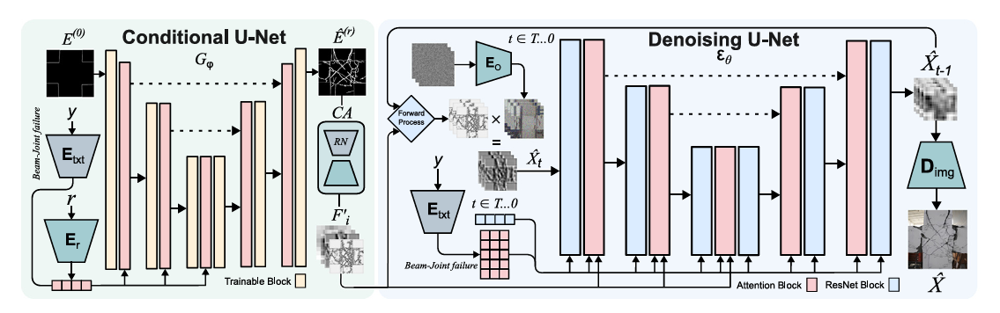
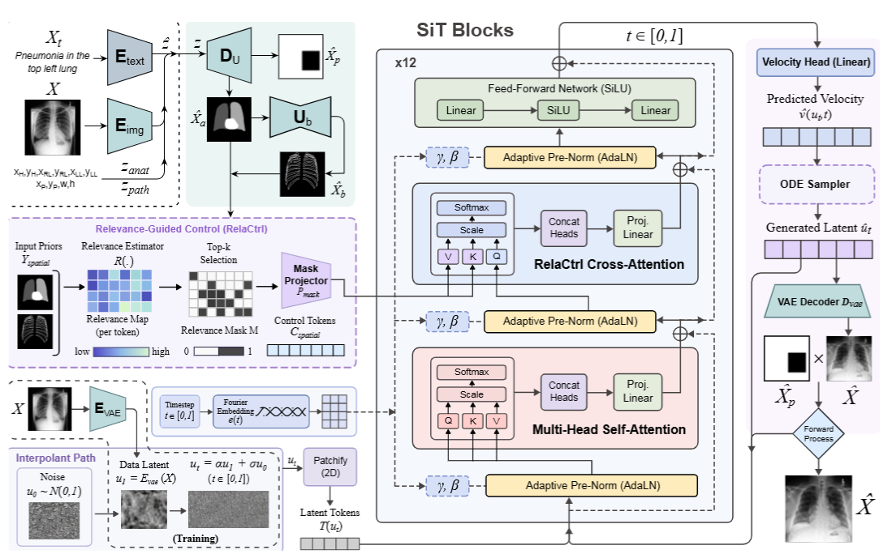
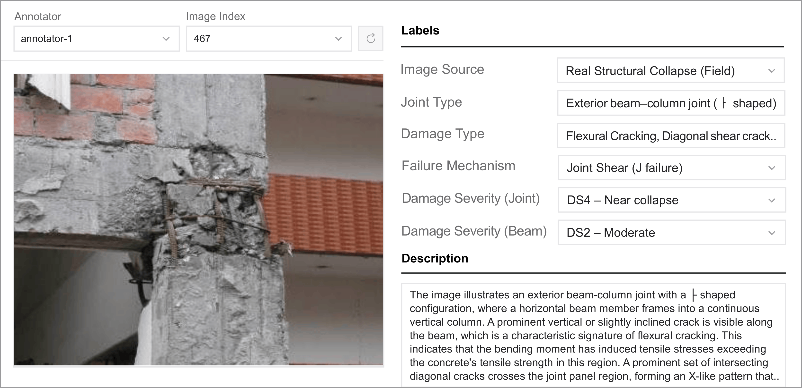
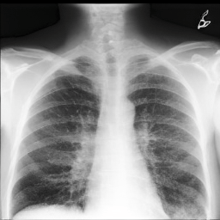
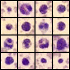

  

    

  <h1>Vadim Atlassov</h1>
  

    MSc Researcher at the <strong>HCI Lab</strong>, Nazarbayev University, supervised by
    <strong><a href="https://scholar.google.com/citations?user=ipi5AVsAAAAJ&hl=ko">Prof. Minho Lee</a></strong>.
    Research focus: <strong>physically-grounded generative AI</strong> for medicine and civil engineering.
  

  

    <strong>Actively seeking PhD positions.</strong> Research interests include:
    <ul class="skills-list">
      <li><strong>Generative AI:</strong> Latent Diffusion (LDM), Flow Matching, Latent Disentanglement, Spatial-Latent Alignment.</li>
      <li><strong>Multimodal Learning:</strong> Vision-Language Models (VLM), Mixture-of-Experts (MoE) Adapters, DINOv2, Semantic Grounding.</li>
      <li><strong>Domain Applications:</strong> Medical Imaging (Chest X-ray, Mammography), AI for Structural Health Monitoring (RC Beam Failure Diagnosis).</li>
    </ul>
  

  

    <a href="https://www.linkedin.com/in/vadim-atlassov">LinkedIn</a>
    <a href="mailto:vadim.atlassov@nu.edu.kz">Email</a>
    <a href="https://github.com/Vadim-ATL">GitHub</a>
    <a href="https://scholar.google.com/citations?hl=ko&user=1IG1kf0AAAAJ">Scholar</a>
  

  

  <h2 id="publications">Publications &amp; Preprints</h2>
  

    

      
      

        
Controllable Diffusion-Based Image Generation for Failure Diagnosis of Reinforced Concrete Beam–Column Joints

        
Journal of Building Engineering, Vol. 128 (2026) 116466 — Elsevier, IF 7.4, Q1 — <strong>Accepted</strong>

        

          <strong>Quantitative Results:</strong> The model demonstrated high fidelity and structural consistency, achieving a <abbr title="Kernel Inception Distance">KID</abbr> of 0.0628 and <abbr title="Structural Similarity Index">SSIM</abbr> of 0.790, outperforming ControlNet, CycleGAN, and Pix2Pix baselines.
        

        
<strong>Diagnostic Accuracy Gains:</strong>

        <ul>
          <li>Failure-Type Classification: <strong>+5.2%</strong> (to 85.8%)</li>
          <li>Rebar Exposure Detection: <strong>+11.9%</strong> (to 95.2%)</li>
          <li>Flexural Cracking Detection: <strong>+12.9%</strong> (to 84.3%)</li>
          <li>Concrete Spalling Detection: <strong>+11.5%</strong> (to 85.3%)</li>
        </ul>
        

          <strong>Expert Validation:</strong> Structural Realism: 4.12/5; Assessment Clarity: 3.98/5.
        

        

          <a href="https://github.com/nubcico/GenBeamJoint" target="_blank" rel="noopener">Code</a>
          |
          <a href="https://doi.org/10.1016/j.jobe.2026.116466" target="_blank" rel="noopener">Paper</a>
        

      

    

  

  

    

      
      

        
Latent-Aligned Diffusion for Controllable Chest X-ray Synthesis

        
Computerized Medical Imaging and Graphics (CMIG), 2025 — Under Review

        

          <strong>Quantitative Results:</strong> On the <a href="https://physionet.org/content/mimic-cxr/2.1.0/" style="color: inherit; text-decoration: none;">MIMIC-CXR</a> dataset, the model achieved <abbr title="Fréchet Inception Distance">FID</abbr> 45.38, MS-SSIM 0.736, and Dice 0.6564, outperforming RoentGen, CheXGen, and XReal baselines.
        

        

          <strong>Clinical Utility:</strong> Synthetic augmentation improved downstream pneumonia classification accuracy by 17.5% and AUC by 4.2%.
        

        

          <strong>Radiologist Validation:</strong> Anatomical plausibility 3.8/5; pathology expression 3.95/5.
        

        

          <a href="https://github.com/nubcico/XrayGen/tree/main" target="_blank" rel="noopener">Code</a>
        

      

    

  

  

    

      
      

        
RC-BCJ-Dataset: A Benchmark Image Dataset of Reinforced Concrete Beam–Column Joint Failures

        
Scientific Data (Nature Portfolio), 2026 — Under Review

        

          <strong>Dataset Overview:</strong> 572 annotated images of RC beam–column joint failures with expert-verified multi-attribute annotations for structural damage recognition, vision–language modeling, and generative modeling.
        

        
<strong>Annotations:</strong>

        <ul>
          <li><strong>Categorical labels:</strong> Joint type, failure mechanism (B / J / BJ), damage type, damage severity (DS0–DS4)</li>
          <li><strong>1,716 expert-written diagnostic descriptions</strong> (3 per image) for image-to-text and multimodal learning</li>
          <li><strong>Segmentation masks</strong> for background, beam, column, and joint-core regions</li>
        </ul>
        

          <strong>Baseline Results:</strong> Failure-mode classification up to 70.30% accuracy (ViT-B/16); best image-to-text generation (Qwen3-VL-4B): BLEU-4 0.82, BERTScore 0.98.
        

        

          <a href="https://zenodo.org/records/20268086" target="_blank" rel="noopener">Dataset</a>
          |
          <a href="https://github.com/nubcico/RC-BCJ-Dataset" target="_blank" rel="noopener">Code</a>
        

      

    

  

  <h2 id="news">News</h2>
  

    Jun 2026
    Paper accepted at <strong>Journal of Building Engineering</strong> (Elsevier, IF 7.4, Q1) — controllable diffusion for RC structural failure diagnosis. <a href="https://doi.org/10.1016/j.jobe.2026.116466">DOI</a>
  

  

    2026
    Benchmark dataset paper on RC beam-column joint failures submitted to <strong>Scientific Data</strong> (Nature Portfolio) — under review.
  

  

    2025
    Paper on latent-aligned diffusion for chest X-ray synthesis submitted to <strong>Computerized Medical Imaging and Graphics</strong> — Under review.
  

  <h2 id="projects">Projects</h2>
    

      
      

        
<a href="https://github.com/Vadim-ATL/Counterfactual-CXR-Generation">Counterfactual Chest X-Ray Generation</a>

        

          Disentangled anatomy and diffusion transformers (SiT) for counterfactual disease trajectory generation in chest X-rays. Simulates realistic progression (Healthy → Sick) and regression (Sick → Healthy) while preserving patient identity via orthogonal spatial latents.
        

        

          Medical Imaging
          Diffusion Transformers
          Counterfactual
          MIMIC-CXR
        

      

    

  

  

    

      
      

        
<a href="https://github.com/Vadim-ATL/BloodMNIST-DDPM">BloodMNIST-DDPM</a>

        

          Diffusion model for synthesizing realistic blood cell microscopy images. Generates 8 cell types with clinically accurate morphology.
        

        

          Medical Imaging
          DDPM
          Hematology
        

      

    

  

