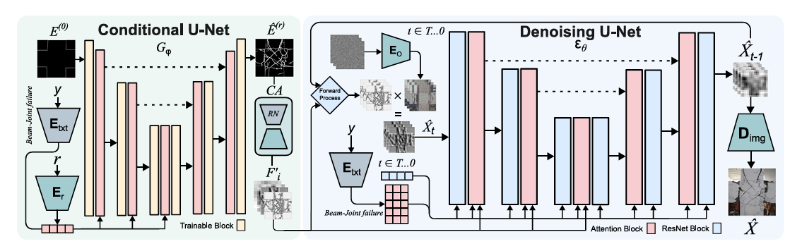
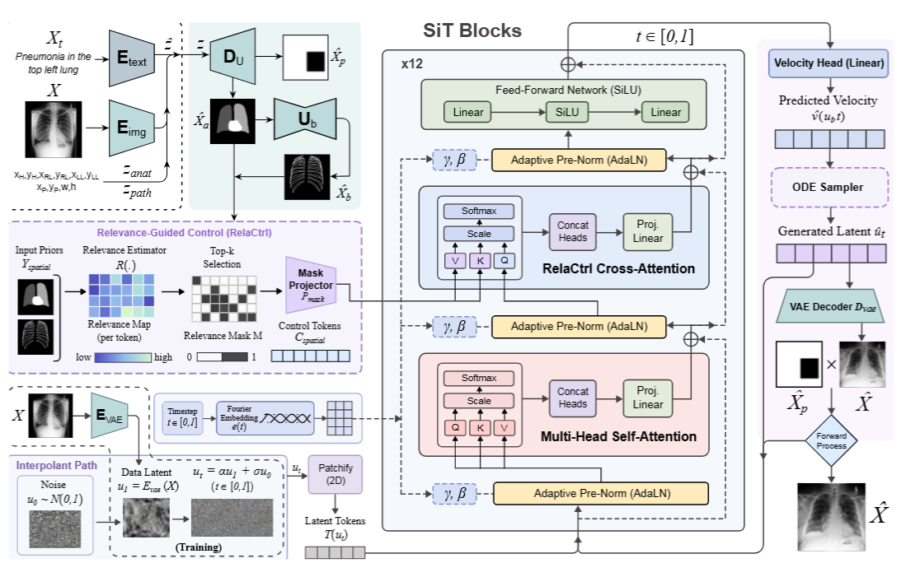
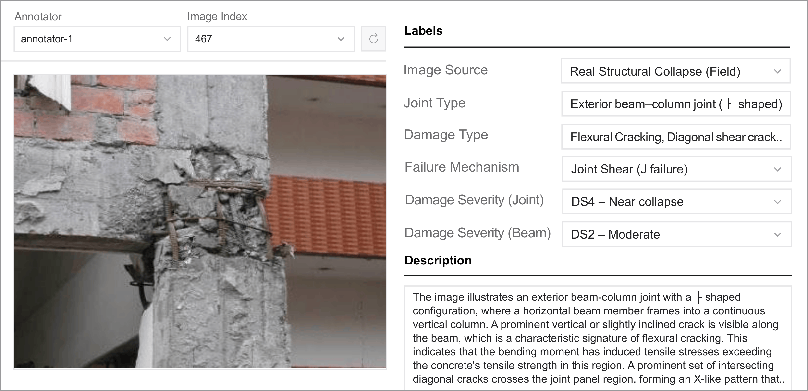
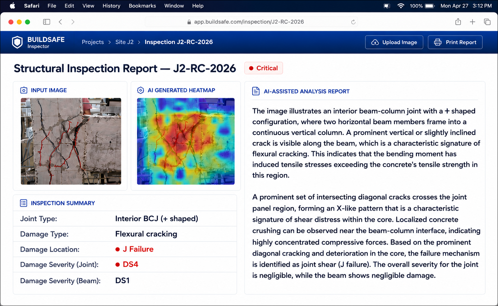
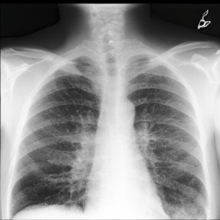
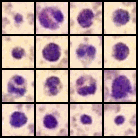

<header class="profile" id="about">
  

    <h1>Vadim Atlassov</h1>
    
I am an MSc researcher in the HCI Lab at Nazarbayev University, supervised by <a href="https://scholar.google.com/citations?user=ipi5AVsAAAAJ&amp;hl=ko">Prof. Minho Lee</a>.

    
I work on generative models and multimodal learning for computer vision, with a focus on controllable image generation and latent alignment. I study diffusion models, flow matching, and vision-language models (VLMs). Medical imaging and structural engineering are application domains for this work.

    
Actively seeking PhD positions.

    

      <a href="https://raw.githubusercontent.com/Vadim-ATL/Vadim-ATL/main/CV.pdf">CV</a>
      <a href="https://scholar.google.com/citations?hl=ko&amp;user=1IG1kf0AAAAJ">Google Scholar</a>
      <a href="https://github.com/Vadim-ATL">GitHub</a>
      <a href="mailto:vadim.atlassov@nu.edu.kz">Email</a>
      <a href="https://www.linkedin.com/in/vadim-atlassov">LinkedIn</a>
    

  

  
</header>

<section aria-labelledby="publications">
  <h2 id="publications">Publications &amp; manuscripts</h2>
  <article class="entry">
    
    

      <h3><a href="https://doi.org/10.1016/j.jobe.2026.116466">Controllable Diffusion-Based Image Generation for Failure Diagnosis of Reinforced Concrete Beam–Column Joints</a></h3>
      
<strong>Vadim Atlassov</strong>, Isabella Schlattner, Yelzhas Omarov, Hyunjin Ju, Min-Ho Lee

      
<em>Journal of Building Engineering</em>, 128, 116466, 2026 · Accepted · <strong>First author</strong>

      
I developed controllable diffusion for generating structural damage images. Synthetic training data improved failure diagnosis across four classification tasks.

      
<a href="https://doi.org/10.1016/j.jobe.2026.116466">Paper</a><a href="https://github.com/nubcico/GenBeamJoint">Code</a>

    

  </article>
  <article class="entry">
    
    

      <h3>Latent-Aligned Scalable Interpolant Transformer for Controllable Chest X-ray Synthesis</h3>
      
Isabella Schlattner, <strong>Vadim Atlassov</strong>, Azimzhan Abdrakhmanov, Minho Lee

      
Submitted to <em>Computerized Medical Imaging and Graphics</em>, 2025 · Under review

      
<strong>Core technical contributor.</strong> I designed and implemented the anatomy–pathology latent alignment and latent-to-spatial decoder, fine-tuned SiT on <a href="https://physionet.org/content/mimic-cxr/2.1.0/">MIMIC-CXR</a>, and built and evaluated the inpainting, counterfactual, and anatomic control pipelines.

      
<a href="https://github.com/nubcico/XrayGen/tree/main">Code</a>

    

  </article>
  <article class="entry">
    
    

      <h3>RC-BCJ-Dataset: A Benchmark Image Dataset of Reinforced Concrete Beam–Column Joint Failures</h3>
      
Min-Ho Lee, Azimzhan Abdrakhmanov, <strong>Vadim Atlassov</strong>, Isabella Schlattner, Dongho Kim, Hyunjin Ju

      
Submitted to <em>Scientific Data</em>, 2026 · Under review

      
I led curation and annotation design for 572 images with diagnostic descriptions and segmentation masks. I implemented and evaluated the classification, image-to-text, and conditional generation baselines, including DINOv2/v3, VLMs, and diffusion models, and deployed the dataset on Zenodo.

      
<a href="https://zenodo.org/records/20268086">Dataset</a><a href="https://github.com/nubcico/RC-BCJ-Dataset">Code</a>

    

  </article>
</section>

<section aria-labelledby="projects">
  <h2 id="projects">Research projects</h2>
  
Current work and implementations.

  <article class="entry">
    
    

      <h3><a href="https://github.com/Vadim-ATL/RECON/tree/main">RECON: A Vision-Language Model for Automated Damage Assessment and Reporting of RC Beam–Column Joints</a></h3>
      
Work in progress

      
A VLM combining DINOv2, field-aware Mixture-of-Experts, and a Q-Former to turn damage images into diagnostic fields and written reports. I study semantic grounding through attention visualizations and evaluate the reports against expert assessments.

      
<a href="https://github.com/Vadim-ATL/RECON/tree/main">Code</a>

    

  </article>
  <article class="entry">
    
    

      <h3><a href="https://github.com/Vadim-ATL/Counterfactual-CXR-Generation">Counterfactual Chest X-Ray Generation</a></h3>
      
Changing disease severity while preserving anatomy. I use SiT and disentangled spatial latents to generate progression and regression examples on MIMIC-CXR.

      
<a href="https://github.com/Vadim-ATL/Counterfactual-CXR-Generation">Code</a>

    

  </article>
  <article class="entry">
    
    

      <h3><a href="https://github.com/Vadim-ATL/BloodMNIST-DDPM">BloodMNIST-DDPM</a></h3>
      
A diffusion model for blood cell microscopy synthesis, generating samples across eight cell types in BloodMNIST.

      
<a href="https://github.com/Vadim-ATL/BloodMNIST-DDPM">Code</a>

    

  </article>
</section>

<section aria-labelledby="news">
  <h2 id="news">News</h2>
  <dl class="news">
    <dt>Jun 2026</dt><dd>My first-author paper on controllable diffusion was accepted in <em>Journal of Building Engineering</em>. <a href="https://doi.org/10.1016/j.jobe.2026.116466">Paper</a></dd>
    <dt>2026</dt><dd>Our RC-BCJ benchmark dataset manuscript was submitted to <em>Scientific Data</em>.</dd>
    <dt>2025</dt><dd>Our latent-aligned chest X-ray synthesis manuscript was submitted to <em>Computerized Medical Imaging and Graphics</em>.</dd>
  </dl>
</section>

<footer>
  
For my academic background and research experience, see my <a href="https://raw.githubusercontent.com/Vadim-ATL/Vadim-ATL/main/CV.pdf">CV</a>. You can reach me at <a href="mailto:vadim.atlassov@nu.edu.kz">vadim.atlassov@nu.edu.kz</a>.

</footer>
